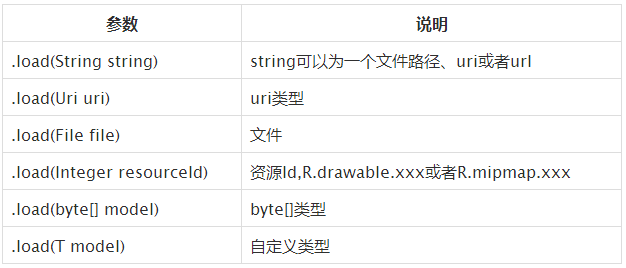

# AutoScrollViewPager
A simple and convenient automatic cycle Viewpager

Features
------------
* Support a variety of resources.



Sample
--------------


Usage
-----
1. Get the resources into your project.

  * Add `AutoScrollViewPager.java` and `autoscrollviewpager.xml`
  * Add `glide-3.6.1.jar` as the library
  
  If your use gradle:
  ```java
    compile 'com.github.bumptech.glide:glide:3.6.1'
  ```
  
2. Use it in xml as normal ViewPager.
  ```xml
  <hxy.com.autoscrollviewpager.AutoScrollViewPager
        android:id="@+id/viewpager"
        android:layout_width="match_parent"
        android:layout_height="250dp"/>
  ```
3. In your code.
  ```java
  List<String> list = new ArrayList<>();
  list.add("https://raw.githubusercontent.com/GitSmark/AutoScrollViewPager/master/test1.jpg");
  list.add("https://raw.githubusercontent.com/GitSmark/AutoScrollViewPager/master/test2.jpg");
  list.add("https://raw.githubusercontent.com/GitSmark/AutoScrollViewPager/master/test3.jpg");
  list.add("https://raw.githubusercontent.com/GitSmark/AutoScrollViewPager/master/test4.jpg");
  list.add("https://raw.githubusercontent.com/GitSmark/AutoScrollViewPager/master/test5.jpg");
  list.add("https://raw.githubusercontent.com/GitSmark/AutoScrollViewPager/master/test6.jpg");
  
  AutoScrollViewPager viewPager = (AutoScrollViewPager) findViewById(R.id.viewpager);
  viewPager.setImageUrls(list);
  viewPager.start();
  //viewPager.stop();
  ```
  
4. public methods.
 - `public void setImageUrls(List<T> Urls)` 
 - `public void setplaceImage(int resources)` 
 - `public void setTime(long time)`
 - `public boolean isPlay()`
 - `public void start()`
 - `public void stop()`
 - `public int getCount()`
 - `public int getCurrentItem()`
 - `public void setAutoPagerListener(AutoScrollerViewPagerListener listener)`

5. Add `AutoScrollerViewPagerListener` if you need.
   ```java
  public interface AutoScrollerViewPagerListener{
        public void onPageSelected(int position);
        public void onPageClicked(int position);
  }
  ```
 
6. Finally, don't forget add `uses-permission`.
   ```xml
  <uses-permission android:name="android.permission.INTERNET" />
  <uses-permission android:name="android.permission.WRITE_EXTERNAL_STORAGE" />
  ```
 
Sample
--------
More usage of the `AutoScrollerViewPager`, Please see the [Sample](https://github.com/GitSmark/AutoScrollViewPager/blob/master/AutoScrollViewPagerSample.rar).

Contact
--------
  Have problem? Just [tweet me](https://twitter.com/huangxy) or [send me an email](mailto:huangxy8023@foxmail.com).

License
--------

    Copyright 2016 huangxy@GitSmark

    Licensed under the Apache License, Version 2.0 (the "License");
    you may not use this file except in compliance with the License.
    You may obtain a copy of the License at

       http://www.apache.org/licenses/LICENSE-2.0

    Unless required by applicable law or agreed to in writing, software
    distributed under the License is distributed on an "AS IS" BASIS,
    WITHOUT WARRANTIES OR CONDITIONS OF ANY KIND, either express or implied.
    See the License for the specific language governing permissions and
    limitations under the License.

